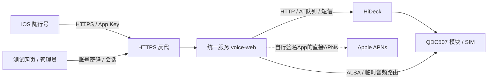

# 项目架构与公开边界

版本 202610094。一套用户自建服务提供网页与iOS两个入口；项目包含四个业务组成，但第三项还承担App的核心后端，不能只把它理解成测试页面。

| 组成 | 职责 | 代码/资料归属 |
|---|---|---|
| HiDeck | 模块发现、短信库、统一AT队列 | 外部项目，固定2.1.23，只引用 |
| Unraid部署与驱动适配 | 宿主串口/声音依赖、开机守护、模块临时路由 | `deploy/unraid/`；第三方驱动引用 |
| 统一服务与测试网页 | App Key、电话控制、SSE/PCM、短信白名单、诊断/推送；网页做基础电话/Key测试 | `server/` 和内嵌 `server/web/` |
| 随行号iOS App | 用户填HTTPS根地址/Key，短信、拨号、系统通话界面、声音与设置 | `ios/`；最终用户入口 |

外部只暴露HTTPS业务入口；Unraid管理API、HiDeck原服务和声音内部端口不直接公网开放。App Key仅是自有API设备凭据。部署者控制服务器、SIM、通信资料与Key，GitHub仓库和App Store分发不承载用户短信/录音。

电话控制始终经HiDeck统一AT队列，声音经宿主ALSA和模块临时驱动，单模块单通话。HiDeck原生电话页不是本服务API，也不代表当前模块已经具备其原生QMI/WebRTC声音路径。第三方驱动/bridge不能称作本项目自研，许可与版本见 [硬件说明](hardware.md)。

公共仓库是唯一源码。`../private/`保存原始/生产配置、签名、日志与装机测试材料；不提交、不复制成另一套源码。日常开发使用同仓库develop，测试产物在仓库外private/testing，验收后合main。流程详见 [发布](releasing.md)。

公共文档描述通用部署和验收能力；现有个人运行流水只留私有资料。开源整理不改线上部署、不改变旧App、不操作硬件，也不宣称新Bundle ID的真机/锁屏已通过。
